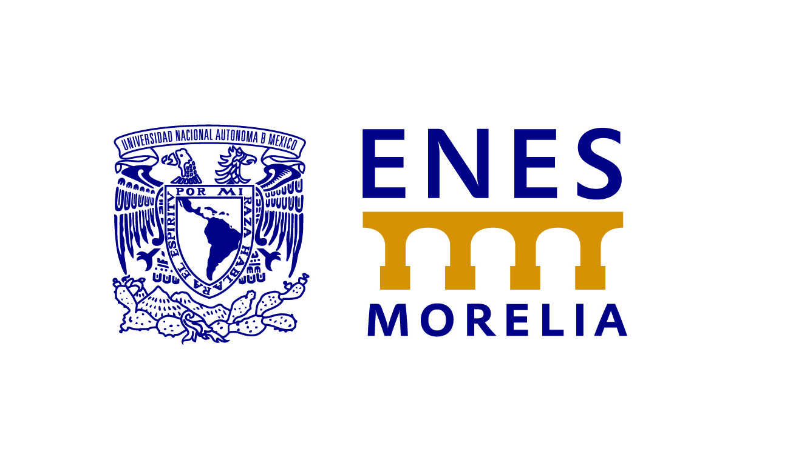
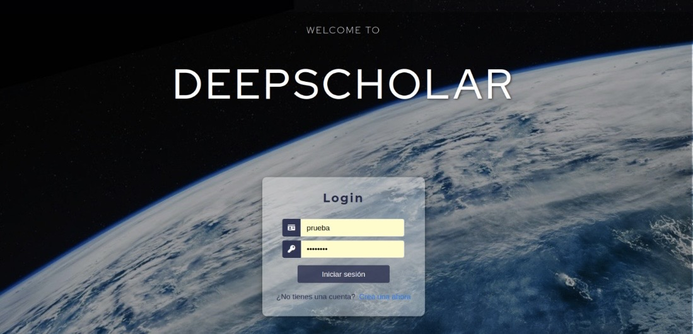
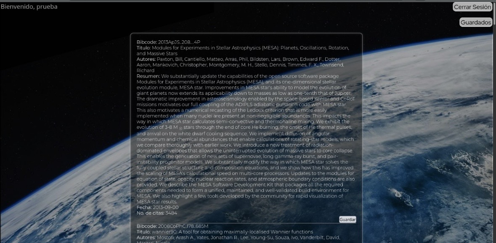

# Deepscholar
Hello, we are Deepscholar

### Team members
Líder: Paola Castillo pcstillo6@gmail.com
 
Testing: Alejandro Cons Andablo alexmixsep@gmail.com
 
Tecnologías: Enrique Luviano kikeluviano1810@gmail.com
 

### Affiliations:

- Autonomous University of Mexico (UNAM)
- National School of Higher Studies (ENES)
 

### Description
People in academia are provided with a way to stay up to date with scientific advances without the process becoming tedious. An interactive and dynamic experience is intended to be created through our app. Summaries of current academic articles are presented, and users’ interests are gradually identified so that more personalized recommendations can be offered.
 

### Methodology
To develop the project, a process was carried out in which different requirements were established so that DataPath could be successfully developed.
 
- The NASA ADS API was integrated to collect scientific articles (API link: https://ui.adsabs.harvard.edu/help/api/).
- In backend development, code was implemented for data extraction from the API, as well as recommendation algorithms, and Django was also used.
- Frontend development was carried out to make the page visually appealing and easy to use for the user.
- Testing and validation.
 

### Implementation
- Backend:  Python, Django 
- Model allenai specter2 (link to the model: https://huggingface.co/allenai/specter2)
- Frontend: HTML, CSS, JavaScript

### Installation and Execution

1. Clone the repository:
   git clone https://github.com/Datapath-org/Deepscholar.git

2. Create and activate the virtual environment:
   python -m venv venv
   
   source venv/bin/activate or
   venv\Scripts\activate  (Windows)

4. Install dependencies:
   pip install -r requirements.txt

5. Set up environment variables:
   Create a .env file inside the Blog/ folder with:
   SECRET_KEY=your_secret_key
   API_TOKEN=your_nasa_ads_token

6. Run the server:
   cd Blog
   python manage.py runserver

### Testing:
Manual testing was performed covering user registration, login, article browsing, saving and deleting articles, and personalized recommendation loading.

### Results:
A functional web application was developed that consumes the NASA ADS API, displays scientific articles, and generates personalized recommendations based on the user's saved article history.

